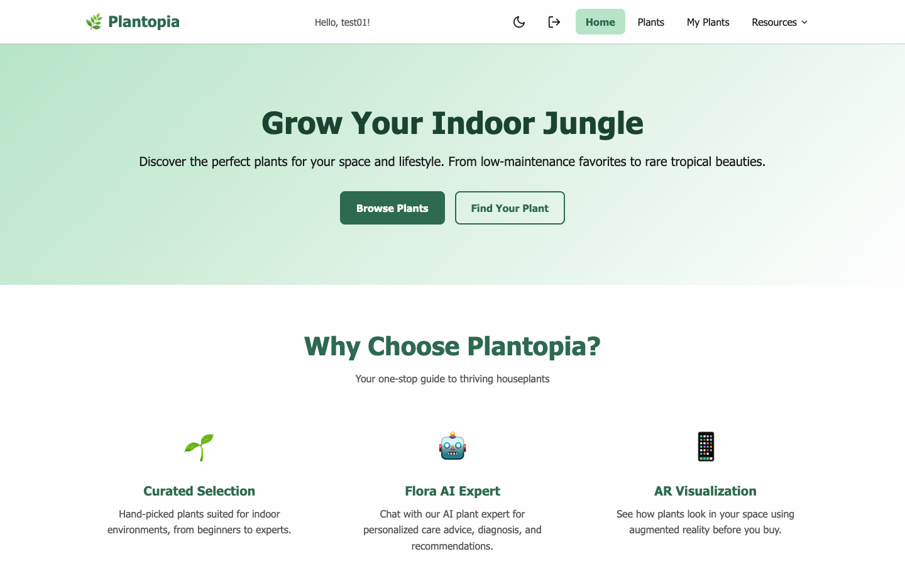
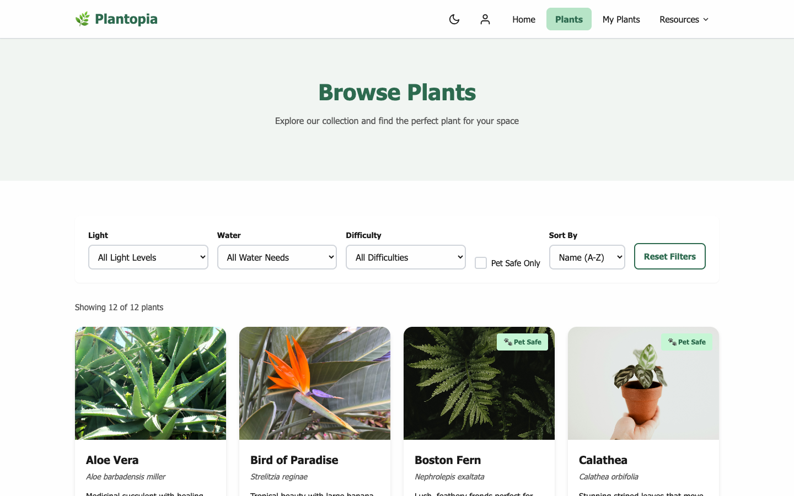
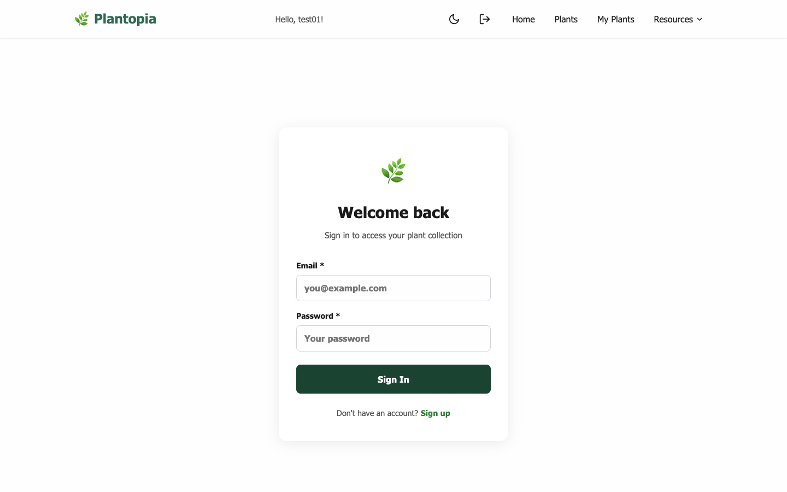
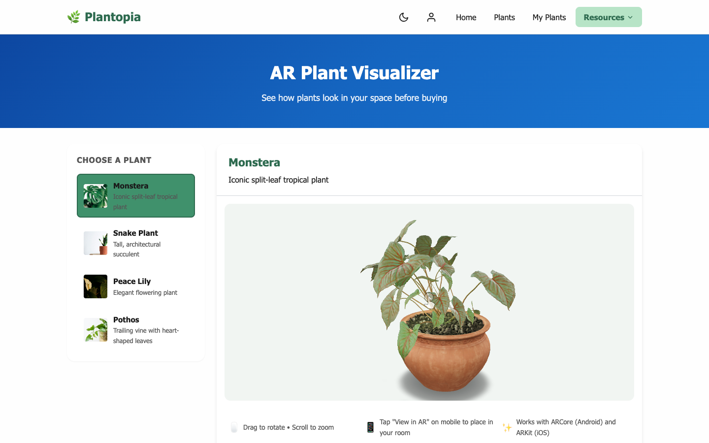
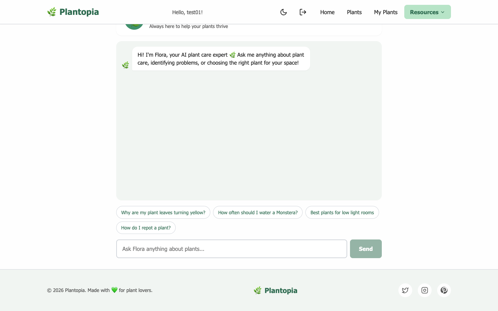
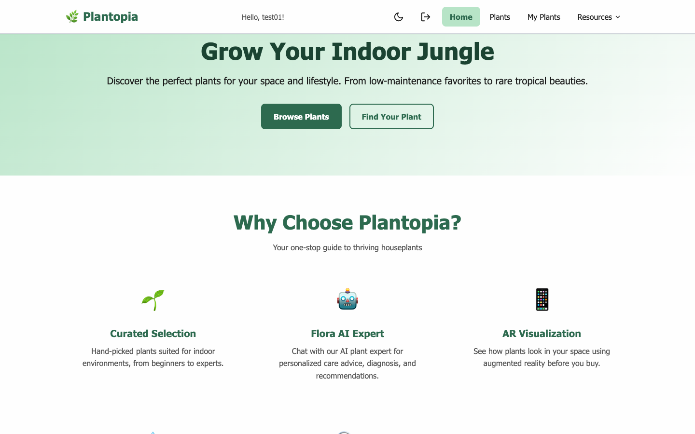
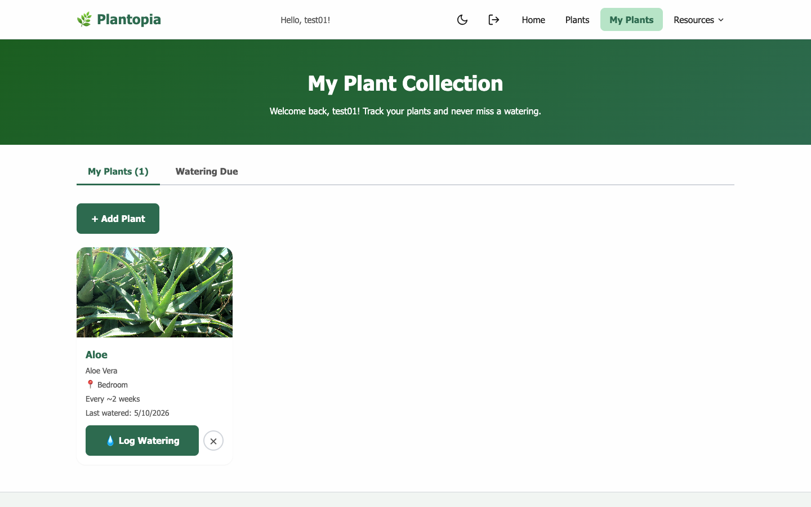

# 🌿 Plantopia — AI-Powered Plant Care Platform

A full-stack web application that helps users discover, identify, and care for houseplants — powered by **Claude AI** (primary) + **Gemini AI** (fallback), augmented reality, real-time WebSocket alerts, JWT authentication, PostgreSQL, and Docker.

[](https://github.com/kneha07/plantopia)
[](https://nodejs.org)
[](https://react.dev)
[](https://postgresql.org)
[](https://docker.com)

---

## 🎬 Demo Video

https://github.com/user-attachments/assets/demo.mp4

> *Full walkthrough: Home → Plants → Login → My Plants → Flora AI Chat → Plant AI → AR Visualizer*

---

## 📸 Screenshots

| Home | Plant Gallery |
|------|--------------|
|  |  |

| Sign In | AR Plant Visualizer |
|---------|-------------------|
|  |  |

| Flora AI Chat | Plant AI Tools |
|--------------|---------------|
|  |  |

| My Plant Collection |
|--------------------|
|  |

---

## ✨ Features

### 🤖 AI-Powered (Claude + Gemini)
- **Flora AI Chatbot** — Conversational plant care expert with persistent session memory
- **Plant Identifier** — Upload a photo to instantly identify any plant with confidence score
- **Health Diagnosis** — Photo-based plant health analysis: issues, causes, treatments, follow-up questions
- **Smart Recommendations** — AI suggests plants based on your lifestyle, light level, pets, and space
- **Claude primary / Gemini fallback** — Automatic failover; works with either API key

### 📱 Augmented Reality
- **Web AR Visualizer** — Place real 3D plant models in your space using your phone camera
- **ARCore (Android) + ARKit (iOS)** support via Google's `<model-viewer>` web component
- **Interactive 3D viewer** on desktop — drag to rotate, scroll to zoom
- Local CC0 plant GLB models (no external CDN dependency)

### 🌿 Plant Management
- **Plant Collection Tracker** — Save and manage your personal plant collection
- **Watering Schedule** — Log waterings; see plants overdue for water
- **Real-time Alerts** — WebSocket push notifications when plants need watering
- **Plant Gallery** — 12+ plants with light, water, difficulty, and pet-safe filters
- **Plant Finder Quiz** — Answer a few questions to find your perfect plant

### 🔐 Authentication & Security
- JWT access + refresh token authentication
- Bcrypt password hashing
- Rate limiting on all AI endpoints (20 req/min)
- CORS locked to localhost in development

### 🎨 UI/UX
- Light / Dark theme toggle
- Fully responsive — mobile, tablet, desktop
- Accessibility focused (WCAG AA, ARIA, keyboard nav)

---

## 🛠️ Tech Stack

| Layer | Technology |
|---|---|
| Frontend | React 19, Vite, CSS3, Hash Router |
| Backend | Node.js, Express, PostgreSQL, Redis |
| Auth | JWT (access + refresh tokens), bcrypt |
| AI — Primary | Anthropic Claude API (`claude-opus-4-7`) with prompt caching |
| AI — Fallback | Google Gemini API (`gemini-2.5-flash`) |
| AR | Google `<model-viewer>` (WebXR, ARCore, ARKit) |
| Real-time | WebSocket (`ws`) — watering alerts |
| DevOps | Docker, Docker Compose, GitHub Actions CI |
| Testing | Jest, Supertest |
| Mobile | Expo, React Native |

---

## 📁 Project Structure

```
plantopia/
├── frontend/                   # React + Vite web app
│   ├── src/
│   │   ├── components/
│   │   │   ├── Header/         # Navigation header with auth state
│   │   │   ├── PlantCard/      # Reusable plant card
│   │   │   ├── FilterControls/ # Plant gallery filters
│   │   │   └── ThemeToggle/    # Light/dark switcher
│   │   ├── context/
│   │   │   └── AuthContext.jsx # JWT auth state + refresh logic
│   │   └── pages/
│   │       ├── Home/           # Landing page
│   │       ├── Plants/         # Plant gallery with filters
│   │       ├── PlantFinder/    # Plant recommendation quiz
│   │       ├── AIChat/         # Flora AI chatbot (persistent sessions)
│   │       ├── PlantAI/        # Identify / Diagnose / Recommend
│   │       ├── ARView/         # AR plant visualizer
│   │       ├── MyPlants/       # Collection + watering tracker
│   │       └── Auth/           # Login / Register
│   ├── public/
│   │   ├── images/             # Plant images
│   │   └── models/             # Local GLB plant 3D models (CC0)
│   └── vite.config.js          # Vite config with /api proxy
│
├── backend/                    # Express API server
│   ├── routes/
│   │   ├── auth.js             # Register, login, refresh, /me
│   │   ├── plants.js           # Plants CRUD + collection + watering
│   │   └── ai.js               # AI endpoints (chat, identify, diagnose, recommend)
│   ├── services/
│   │   └── aiService.js        # Claude primary + Gemini fallback abstraction
│   ├── middleware/
│   │   └── auth.js             # JWT authenticate middleware
│   ├── db.js                   # PostgreSQL pool + schema init
│   ├── server.js               # Express app + WebSocket server
│   ├── .env.example            # Environment variable template
│   └── Dockerfile
│
├── mobile/                     # Expo React Native companion app
├── docker-compose.yml          # Postgres + Redis + backend + frontend
├── .github/workflows/          # CI/CD pipeline
└── screenshots/                # App screenshots for README
```

---

## 🚀 Getting Started

### Prerequisites
- Node.js v18+
- PostgreSQL 14+ running locally **or** Docker
- Gemini API key — [aistudio.google.com/apikey](https://aistudio.google.com/apikey)
- (Optional) Anthropic API key — [console.anthropic.com](https://console.anthropic.com)

### Option A — Docker (recommended)

```bash
git clone https://github.com/kneha07/plantopia.git
cd plantopia
cp backend/.env.example backend/.env
# Add your API keys to backend/.env
docker-compose up
```

Frontend → http://localhost:5173 | Backend → http://localhost:3001

### Option B — Manual

```bash
# 1. Clone
git clone https://github.com/kneha07/plantopia.git
cd plantopia

# 2. Backend setup
cd backend
cp .env.example .env
# Edit .env — add GEMINI_API_KEY (and optionally ANTHROPIC_API_KEY)
npm install
node server.js

# 3. Frontend setup (new terminal)
cd frontend
npm install
npm run dev
```

Frontend → http://localhost:5173 | Backend → http://localhost:3001

### Environment Variables

```env
# backend/.env
ANTHROPIC_API_KEY=your_claude_key_here   # Optional — Claude is primary if set
GEMINI_API_KEY=your_gemini_key_here       # Required — fallback (or sole) AI
PORT=3001
DATABASE_URL=postgresql://localhost:5432/plantopia
REDIS_URL=redis://localhost:6379
JWT_SECRET=your-strong-secret
JWT_REFRESH_SECRET=your-strong-refresh-secret
```

> **AI Provider Logic:** If `ANTHROPIC_API_KEY` is set, Claude is used for all AI features with Gemini as automatic fallback. If only `GEMINI_API_KEY` is set, Gemini handles everything.

---

## 🔌 API Endpoints

### Auth
| Method | Endpoint | Description |
|--------|----------|-------------|
| POST | `/api/auth/register` | Create account |
| POST | `/api/auth/login` | Login → access + refresh tokens |
| POST | `/api/auth/refresh` | Rotate refresh token |
| GET | `/api/auth/me` | Current user profile |

### Plants
| Method | Endpoint | Description |
|--------|----------|-------------|
| GET | `/api/plants` | All plants (Redis cached) |
| GET | `/api/plants/:id` | Single plant detail |
| GET | `/api/plants/collection/all` | My plant collection |
| POST | `/api/plants/collection` | Add plant to collection |
| DELETE | `/api/plants/collection/:id` | Remove plant |
| POST | `/api/plants/collection/:id/water` | Log a watering |
| GET | `/api/plants/schedule/due` | Plants overdue for watering |

### AI
| Method | Endpoint | Description |
|--------|----------|-------------|
| POST | `/api/ai/chat` | Chat with Flora (persistent memory) |
| GET | `/api/ai/chat/sessions` | List chat sessions |
| GET | `/api/ai/chat/sessions/:id` | Session message history |
| POST | `/api/ai/identify` | Identify plant from photo |
| POST | `/api/ai/diagnose` | Diagnose plant health from photo |
| GET | `/api/ai/diagnoses` | Diagnosis history |
| POST | `/api/ai/recommend` | AI plant recommendations |

### WebSocket
| Endpoint | Description |
|----------|-------------|
| `WS /ws?token=<jwt>` | Real-time watering alerts |

---

## 🌱 Plant Database

12 plants with full care profiles in PostgreSQL:

| Plant | Scientific Name | Difficulty | Pet Safe |
|-------|----------------|------------|----------|
| Aloe Vera | Aloe barbadensis miller | Easy | No |
| Bird of Paradise | Strelitzia reginae | Moderate | No |
| Boston Fern | Nephrolepis exaltata | Moderate | Yes |
| Calathea | Calathea orbifolia | Expert | Yes |
| Fiddle Leaf Fig | Ficus lyrata | Expert | No |
| Monstera | Monstera deliciosa | Moderate | No |
| Peace Lily | Spathiphyllum | Easy | No |
| Peperomia | Peperomia obtusifolia | Easy | Yes |
| Pothos | Epipremnum aureum | Easy | No |
| Rubber Plant | Ficus elastica | Moderate | No |
| Snake Plant | Sansevieria trifasciata | Easy | No |
| Spider Plant | Chlorophytum comosum | Easy | Yes |

---

## 🧪 Testing

```bash
cd backend
npm test          # Jest + Supertest integration tests
npm run test:watch
```

Tests cover: auth routes, plant CRUD, AI endpoint mocking, WebSocket connection.

---

## 🐳 Docker

```bash
# Start all services (Postgres, Redis, backend, frontend)
docker-compose up

# Rebuild after code changes
docker-compose up --build

# Stop
docker-compose down
```

---

## ♿ Accessibility

- WCAG AA compliant color contrast
- Full keyboard navigation
- Screen reader support with ARIA attributes
- Skip link to main content
- Reduced motion support

---

## 📄 License

MIT License — open source and free to use.

Plant images from [Unsplash](https://unsplash.com) (Unsplash License).
3D models from [KhronosGroup glTF Sample Assets](https://github.com/KhronosGroup/glTF-Sample-Assets) (CC0).
AR powered by [Google model-viewer](https://modelviewer.dev/).

---

## 👤 Author

<div align="center">

### **Neha Kumari**

*Software Development Engineer | Full Stack Developer | React Enthusiast* 🌿

[](https://www.linkedin.com/in/kneha101n/)
[](https://github.com/kneha07)

</div>

Graduate student in Information Systems at Northeastern University with 3+ years of experience in software development and quality assurance. Passionate about building accessible, AI-powered web applications.

**Skills:** React • Node.js • Express • PostgreSQL • Redis • Claude AI • Gemini AI • WebSocket • AR/WebXR • Docker • JWT • Python • Java • Test Automation

---

<div align="center">

⭐ Star this repo if you find it helpful!

**Made with 🌿 and ☕ by Neha Kumari** | *May 2026*

</div>
